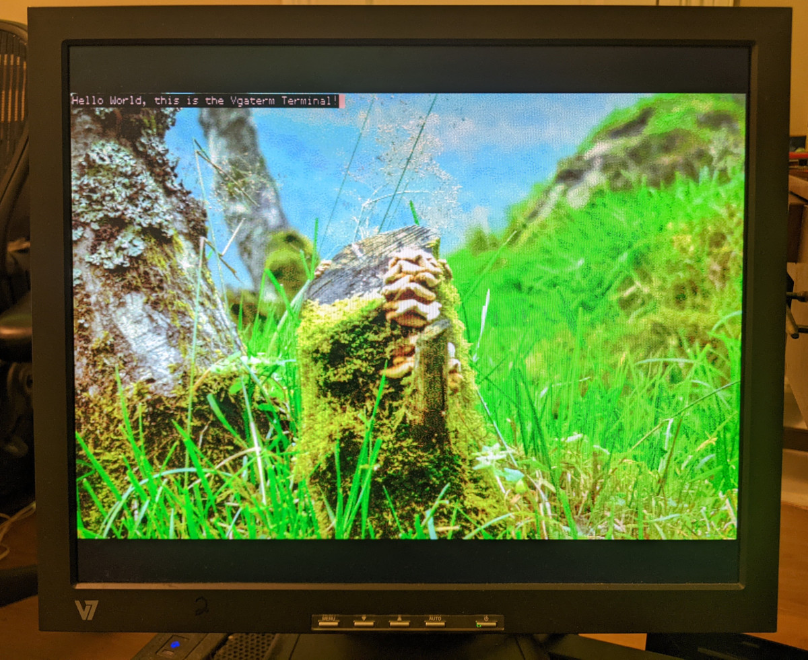
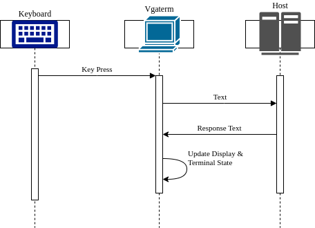
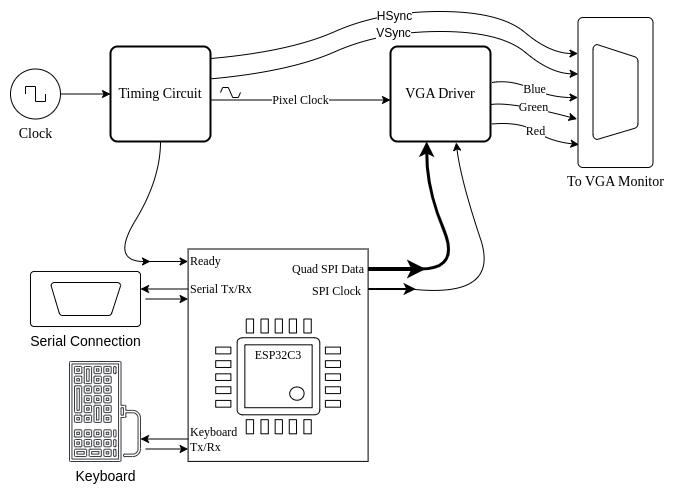

# esp32c3-vgaterm

Vgaterm is a bare metal VGA driver and serial terminal written for RISC-V (`rv32imc`) on the esp32-c3 from Espressif. It supports 256 Colors (4 red, 8 green, 8 blue) with a resolution of 640x400 pixels (using the 640x480 standard: http://tinyvga.com/vga-timing/640x480@60Hz)

This is the software that interacts with the VGA timing circuitry and VGA hardware to display pixel data stored in the video buffer in the CPU memory.

The video memory is transmitted to the VGA Driver circuitry once a frame via the Quad SPI module on the esp32c3 and the VGA Driver converts the incoming data into Red, Green, and Blue analog voltage signals according to the VGA spec. A new frame is initiated by the Timing Circuit.

### Vgaterm Terminal Communication

### Vgaterm Connections to External Circuitry

# Installation and Prerquisites

1. Activate rust nightly:

`rustup override set nightly`

2. Activate the risc-v target:

`rustup target add riscv32imc-unknown-none-elf`

3. Using Cargo, install the `espflash` tool which can upload and flash the code across a serial
port (through usb) to the esp32 chip:

`cargo install espflash`

> You may need `libudev-dev` as a dependency on linux: `sudo apt install libudev-dev`

At this point you are ready to build and upload

# Building

1. Build:

`cargo build`

2. Flash to the CPU

`espflash flash /dev/ttyUSB0 target/riscv32imac-unknown-none-elf/debug/vgaterm --monitor --format direct-boot`

Where `/dev/ttyUSB0` should be whatever serial port the esp32 is connected to. It's highly recommended that your user
is added to the `dialout` group which will allow you to interact with `/dev/ttyUSB0` without using sudo.

Also it's important to note the `--format direct-boot` in order to properly flash the code in our bare metal environment.

# Notes
* See https://github.com/esp-rs/esp-hal/tree/main/esp32c3-hal/examples for examples
* We use "direct boot": https://github.com/esp-rs/espflash/issues/53
    * https://github.com/espressif/esp32c3-direct-boot-example
* ESP32 setup: https://esp-rs.github.io/book/tooling/espflash.html
* ESP32-C3 HAL docs: https://docs.rs/esp32c3/latest/esp32c3/

# Operation

This repo contains the rust code that operates Vgaterm circuitry. The code is largely divided into two parts:

1) Every frame the CPU emits the contents of the video memory via the Quad SPI module into the VGA driver circuitry to display the video frame.
2) Acting as a serial terminal: Receiving serial data and updating the display and transmitting any keyboard input to the serial connection.

## Vgaterm connections

### `Ready`
_Active Low_, _GPIO3_. This is an input signal that is generated by the Timing Circuit. The Timing Circuit controls all VGA timings according to the spec. Every frame (60 Hz) the Timing Circuit makes the Ready signal go Low to indicate the start of the frame and initiates sending the video memory data to the VGA Driver circuit.

### `Video Memory`
Video memory is a chunk of memory in the CPU 256,000 bytes long (640 x 400 pixels) where each byte represents a single pixel. Pixel colors are controlled by one byte: 3 bits for Blue, 3 bits for Green, and 2 bits for Red. This data gets transmitted via SPI to the VGA driver where each byte gets converted to the 0 to 0.7 volts analog signal VGA uses.

### `Quad SPI and Clock`
SPI data bits 0-3 use _GPIO7_, _GPIO2_, _GPIO5_, and _GPIO4_ respectively. The SPI Clock uses _GPIO6_.

Every two SPI clock cycles a byte is transmitted, 4 bits at a time, using DMA. The VGA Driver circuit will receive the data and convert it into the proper voltage levels for VGA output.

### `Serial Tx/Rx`
_GPIO21_ (_Tx_) and _GPIO20_ (_Rx_) for `Tx` and `Rx` respectively. The main serial connection to external devices use the esp32c3's UART0 module (Univseral Asynchronous Receiver Transmitter). Vgaterm listens to incoming data on `Rx` and interprets data as terminal character input such as characters to display on screen or control codes. Vgaterm uses the `embedded_graphics` crate to update the video buffer with new text inside the `terminal` module.

Vgaterm will transmit characters to connected serial device via `Tx`. This will be mainly keyboard input from the user.

### Keyboard `Tx/Rx`
_GPIO1_ and _GPIO0_ for Keyboard `Tx` and `Rx` respectively. A USB keyboard is connected with this [USB to UART](https://www.tindie.com/products/matzelectronics/ch559-usb-host-to-uart-bridge-module/) device which converts USB into a specialized UART encoding of key presses.

When a key is pressed on the keyboard Vgaterm is interrupted and the key data is interpreted subsequent characters are sent to the terminal module. The terminal then sends these characters to the connected serial device as described in the above section.

